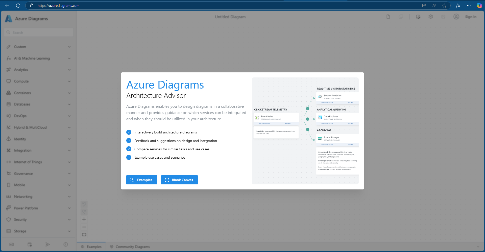
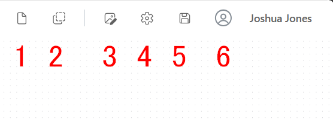
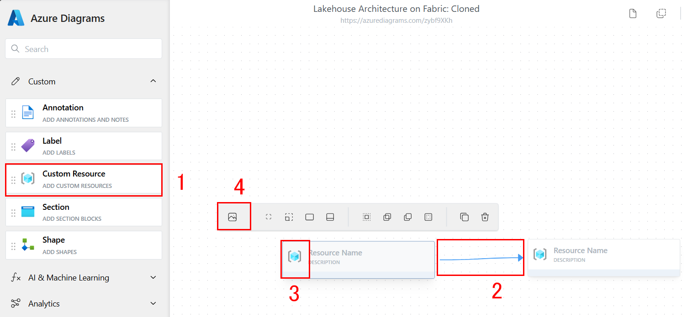
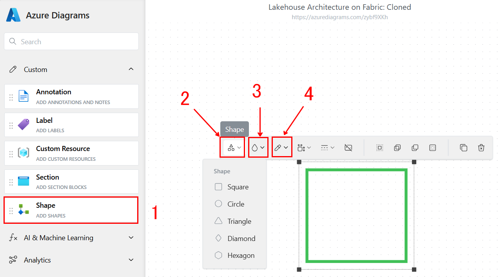
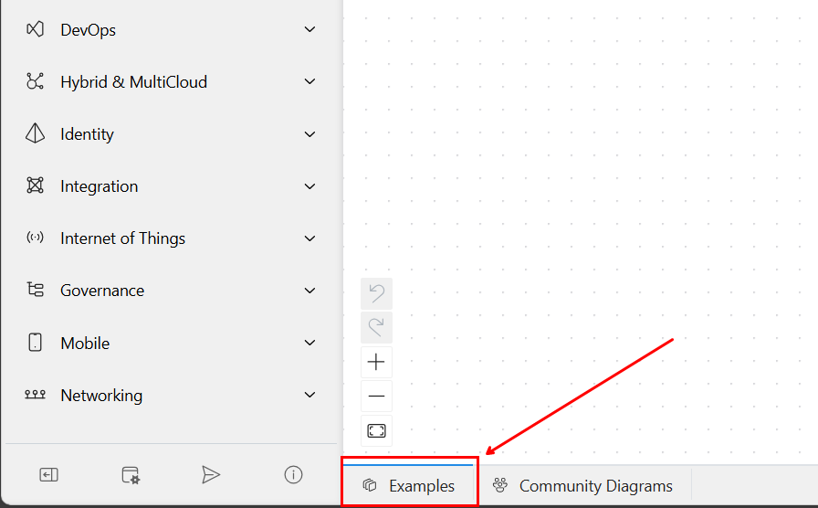
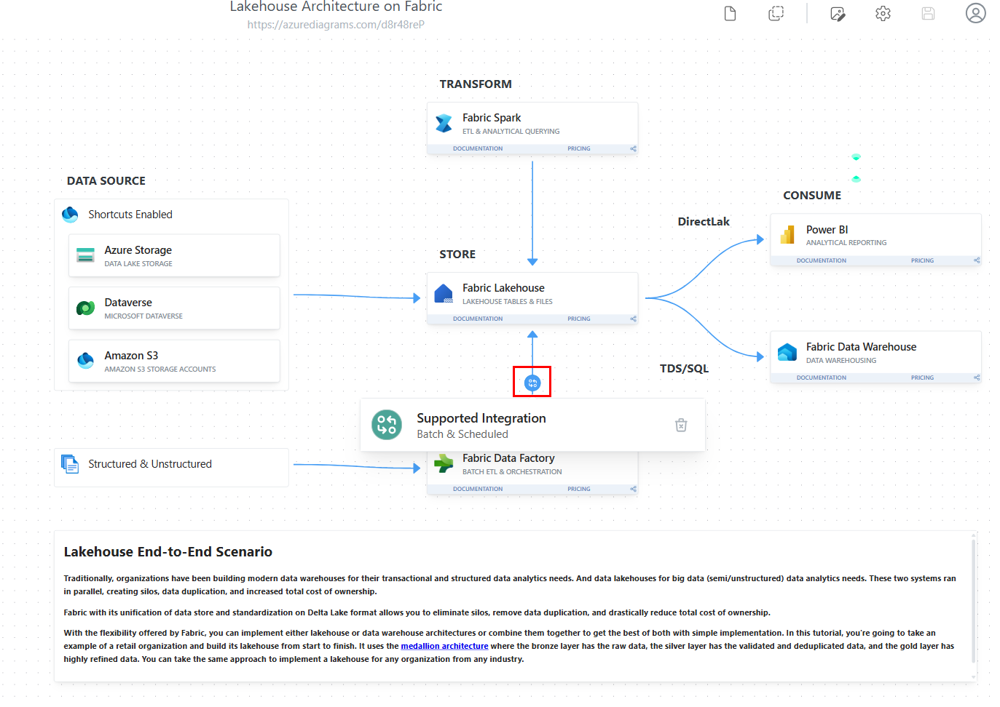

# 🏅Medallion アーキテクチャについて🏠

メダリオン レイクハウス アーキテクチャ (一般に["メダリオン アーキテクチャ"](https://learn.microsoft.com/ja-jp/azure/databricks/lakehouse/medallion) と呼ばれます) は、組織がレイクハウス内のデータを論理的に整理するために使用する設計パターンです。 これは Fabric に推奨される設計アプローチです。

[メダリオン アーキテクチャは、3 つの異なるレイヤー (ゾーン) で構成されています。 各レイヤーは、レイクハウスに保存されているデータの品質を示し、高いレベルは高い品質を表します。 この多層アプローチは、エンタープライズ データ製品にとっての信頼できる唯一のソースを構築するのに役立ちます。

重要なことは、メダリオンアーキテクチャは、データがレイヤーを通過する際に、原子性、一貫性、分離、耐久性（ACID）を保証することです。 生データから始まり、一連の検証と変換により、効率的な分析用に最適化されたデータが作られます。 メダリオン ステージには、ブロンズ (生)、シルバー (検証済み)、ゴールド (強化) の 3 つのステージがあります。

今回の演習の目標は Fabric のアーキテクチャをハンズオンでビルドして、グループで共有する事です。
人の作り方や好みによって、自然に図の見た目のバリエーションがあります。
最も大切なのは、**自分のFabricの理解を深める事です。**

# ☁️Azure Diagrams について☁️
この演習では、無料ツールのAzure Diagramsを使用し、Fabricのアーキテクチャを説明する図を作成します。

Azure Diagramsは、Microsoft の公式なツールではありません。Microsoft の社員がアーキテクチャを説明するために作った便利なリソースです。
費用は一切かかりませんが、会社のセキュリティーおよびコンプライアンスのポリシーに従ってアカウントを作るか判断してください。
今日の演習では、アカウント無しでも実施ができますので、アカウント作成は受講者の自由となります。

Fabricだけではなく、他にもアーキテクチャの図は作成可能：
- Azure
- Power Platform・Dynamics 365
- マイクロソフト以外のベンダー（GCP、AWS等）

## Azure Diagramsへのアクセスと準備

先ずは以下のリンクをブラウザの別タブでアクセスしてください。
**Blank Canvas** を押します。

<!-- This link format lets us open in a seperate tab 😇 -->
<a href="https://azurediagrams.com/" target="_blank">https://azurediagrams.com</a>

## ツールの案内と説明

使い方1️⃣：右上の機能

1. **New Diagram**: 新しい画面を作る操作。編集中のDiagramを保存しないで New Diagram押すと、途中までの図が削除される
    
1. **Clone Diagram**: 表情の図を新しいリンクで複製する
    
1. **Export**:　図を画像としてエクスポートする

1. **Settings**: プロフィールや図についてさまざまな設定。
    
1. **Save Changes**: 変更は自動保存じゃないため、閉じる前に押すこと
    
1. **プロフィール**: （任意）アカウントのログイン、プロフィール編集、パスワード変更
    

使い方2️⃣：左側の図パーツ

1. **Search**: よく利用されるサービスを検索して図に追加する。全てのリソースでもない
    
1. **Annotation**: 長文のテキストを書くためのラベル
    
1. **Label**:　短文のテキストを書くためのラベル

1. **Custom Resource**: 製品やプロセスのカスタムでできるタイル。アイコン、タイトル、サブタイトルが含まれる
    
1. **Section**: 複数のリソースをまとめて表情するためのボックス
    
1. **Shape**: 図形の作成

使い方3️⃣：カスタム リソース

1. **Custom Resource**: ドラッグアンドドロップで図に追加
    
1. **接続・データ フロー**: Custom Resourceの間に線を引くと、データの流れを表示する。リソースの種類によって、自動的線も変わる場合がある
    
1. **カスタマイズ**:　アイコンを押すと、Resource タイルの表示設定を調整

1. **アイコン**: Searchで表示されないアイコンがたくさんある。より細かいアーキテクチャ図を作るならオススメ

使い方4️⃣：カスタム シェイプ

1. **Shapes**: ドラッグアンドドロップで図に追加
    
1. **Shape**: 図形の形を設定する
    
1. **Background Color**:　透明度をマックスに上げると、枠だけの図形になる

1. **Border Color**: 図の枠の色の設定

### **任意**: アカウントの登録

今回の演習は、アカウントを登録せずに全てのタスクは完了可能です。
しかし、アカウントを持っている場合は以下のメリットあります：
- 作った Diagram を保存し、後で編集する
- Diagramを他のユーザーまたはコミュニティーに共有ができる
- 他のユーザーにプライベート（非公開）Diagram 共有とアクセス権限の設定（役割型）

<u><b>サインアップする方法</b></u>

1️⃣

右上の**Sign In**を押して、**Sign in or Create Accountを押します**

2️⃣

**Don't have an account? Sign up now**を押します

3️⃣

以下の画面に、メールアドレスを入力して、メールアドレス確認が終わってからパスワードと名前を設定します。

# ✅Fabricのサンプル アーキテクチャ図を確認する✅

**1️⃣**

左下にある **Examples** を押します

**2️⃣**

Examplesのウィンドウが開かれます。ウィンドウの上をマウスで掴んで(1)、サイズを調整します。
Fabricのサンプル図 **Lakehouse Architecture on Fabric**を探して、クリックします。(2)

**3️⃣**

**Fabric Data Factory**と**Fabric Lakehouse**の間にある接続をマウスでかざして、統合の詳細が **Batch & Scheduled**となっている事を確認します。

**4️⃣**

コミュニティーが提供している例もあります。**Community Diagrams**を押し、ブラウザのページ上検索（Ctrl+F)に「Fabric」を入力して、好きなサンプルを選びます。

# 🏠Fabricのアーキテクチャ図を作成する🌊

## 演習

1. lab 01-04 で実施した内容を Azure Diagrams を使用して作図しましょう

1. （option）1. の図をクローンし、lab 05-07 の内容を反映してみましょう

1. lab 01-04 の作図をメダリオンアーキテクチャとして拡張しましょう

### 回答例

1. [lab 01-04 の回答例へのリンク](./images/diagram-01-04.png) : [Azure Diagrams](https://azurediagrams.com/D54ivtsh)
2. [lab 05-07 の回答例へのリンク](./images/diagram-05-07.png) : [Azure Diagrams](https://azurediagrams.com/e4F4s7l8)
3. [メダリオンアーキテクチャの回答例へのリンク](./images/diagram-medallion.png) : [Azure Diagrams](https://azurediagrams.com/NhmRmML4)

# 📂図のエクスポートと共有🔗

<u><b>図の共有方法は２つあります</b></u>

方法1️⃣：画像として保存

PNGとSVGは使えます。右上の画像アイコンを押して、ファイルタイプを選択します。

SVGを選ぶと、ライブインタラクション（スクロール等）ができます

方法2️⃣：図へのアクセスを共有

３つの共有タイプがあります。
1. **Community**:図は検索可能で、誰でも閲覧でき、**Community Diagrams** に表示されます。
    
1. **Link**:図は検索から隠されていますが、ユニークなリンクを持っている人なら誰でもアクセスできます。

1. **Private**:図は共有した人だけがアクセスできます。

共有するために、Diagram を保存して、設定の歯車 ⚙ を押します。

設定のオプションから、Sharing 👥 を押します。

## リソース

- [Microsoft Fabric でメダリオン Lakehouse アーキテクチャを実装](https://learn.microsoft.com/ja-jp/fabric/onelake/onelake-medallion-lakehouse-architecture)
- [Microsoft Fabric のグリーンフィールド レイクハウス](https://learn.microsoft.com/ja-jp/azure/architecture/example-scenario/data/greenfield-lakehouse-fabric)
- [Microsoft Fabric 開発ガイド](https://speakerdeck.com/ryomaru0825/microsoft-fabric-kai-fa-gaido?slide=31)
